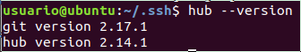
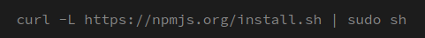

# Descripción de la Práctica 02-p1-t1-iaas-Gandares

El objetivo de esta práctica es la instalación de programas en la máquina virtual para dejarla lista para hacerla funcionar como servidor. A continuación se mostrarán los programas y como se instalaron.

## git y hub

Git en este caso ya venía instalado junto a la máquina virtual y para la instalación de hub, sólo hizo falta hacer lo siguiente:




## git aliases

Git no deduce automáticamente tu comando si lo escribes parcialmente, así que para mas facilidad, se pueden usar los alias para acortar las ordenes:


La última línea guarda las credenciales del usuario de github en un archivo para que cada vez que se realice un git pull o git push no pida nombre de usuario ni contraseña. Puede ser una brecha de seguridad bastante grande pero al estar en una máquina virtual no hay problema.

## git prompt

Para modificar el prompt de bash para que se vea la rama en la que se está es necesario copiar y pegar todo el código escrito en [este link](https://github.com/git/git/blob/master/contrib/completion/git-prompt.sh). Después escribir en el archivo .bashrc -> "source <Ruta del archivo>" y en donde ponga PS1= cambiar lo posterior a -> '[\u@\h \W$(__git_ps1 " (%s)")]\$ '

## ghi

Para instalarlo solo es necesario hacer: 


## nvm

nvm es el controlador de versiones de node. Para instalarlo es necesaria una secuencia de comandos:


```bash
export NVM_DIR="$([ -z "${XDG_CONFIG_HOME-}" ] && printf %s "${HOME}/.nvm" || printf %s "${XDG_CONFIG_HOME}/nvm")"
$NVM_DIR/nvm.sh" ] && \. "$NVM_DIR/nvm.sh"
```
La última linea carga nvm.


## npm

Para instalarlo solo es necesario hacer: 




## nodejs con nvm

Para instalar node con nvm primero se deben de conocer las distintas versiones existentes y eso se puede hacer con:


Una vez se sepa cual instalar se realiza:


En mi caso es la última version, la 13.8.0.


## jshint

Para instalarlo es necesario hacer: ``` npm install -g jshint ```

## rvm y ruby

Para instalar rvm es necesario una serie de comandos:


Reiniciar la máquina.

Ahora, para instalar ruby con rvm es de la siguiente manera:


## NERDTree

Para instalarlo es necesario realizar:
```bash
git clone https://github.com/preservim/nerdtree.git ~/.vim/pack/vendor/start/nerdtree
vim -u NONE -c "helptags ~/.vim/pack/vendor/start/nerdtree/doc" -c q
```

## Express

La instalación de express requiere del uso de un ```npm install express``` dentro de un fichero donde se haya realizado antes un ```npm init```

## Configuración en github

En cuanto a la configuración del github en la máquina virtual, es necesario crear un par clave privada/pública con ```ssh-keygen``` y dicha clave pública colocarla en el github en Settings -> SSH and GPG keys. 

## Configuración del ssh

En cuanto a la configuración del ssh, se modifica en la máquina local el archivo ~/.ssh/config de la siguiente manera:


Y la clave publica se coloca en el ~/.ssh/authorized-keys de la máquina virtual.
