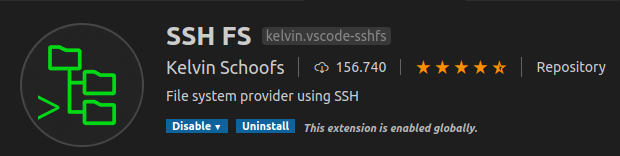
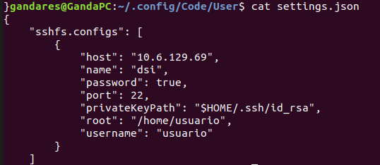
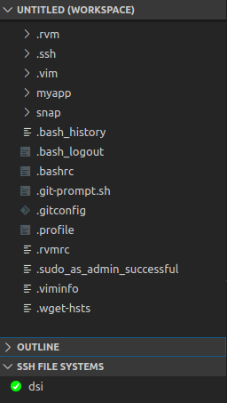
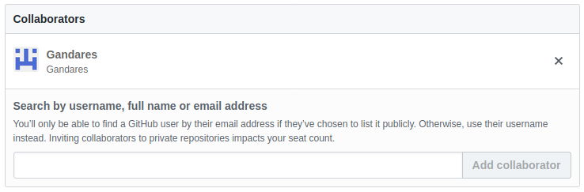

# p2-t1-vscode-Gandares

# Visual Studio Code

Para esta práctica será necesaria la instalación de [VScode](https://code.visualstudio.com/download) y verse algún que otro tutorial para facilitar su uso. Acto seguido añadir la extensión SSH FS.

Esta extensión permite "montar" una carpeta remota sobre SSH como una carpeta de área de trabajo local. 
Una vez instalada -> Control+Shift+P y se busca "SSH FS: Create a SSH configuration", Se crea con los datos de la máquina virtual o con respecto a aquella máquina con la que uno quiera realizar un ssh y se guarda. Los datos de las configuraciones se guardan en $HOME/.config/Code/User/settings.json si se trata de Linux.

Una vez todo configurado, en el SSH FILE SYSTEMS de la columna de la izquierda, click derecho en donde se quiera hacer un ssh y "Connect as Workspace folder". Aparecerá todo el árbol de directorios.

Herramienta bastante util y fácil de configurar.

# Collaborator

En github, los proyectos grandes deben ser gestionados por varios colaboradores y esto es posible añadiéndolos en Settings -> Collaborators. De esta manera, esos usuarios se convierten con colaboradores y pueden trabajar en el repositorio.

