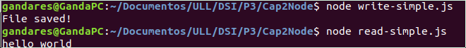

# p2-t1-c3-filesystem-Gandares

<h2>Informe</h2>

En esta práctica se sigue la guía de un libro en el que te expone diversos ejemplos de programas de javascript para la supervisión de, en este caso, el fichero "target.txt", aunque tambien podría ser un directorio perfectamente.

 - watcher.js

El primer programa es muy simple y solo observa si hay cambios en el fichero, además el fichero tiene que estar predefinido, no se le puede pasar. Cuando cambias el contenido de target.txt aparece lo siguiente:

Por mi sistema operativo, modificar el fichero muestra dos "File changed!" y hacer un "touch target.txt" solo uno.

 - watcher-argv.js
 
Este programa hace lo mismo que el anterior pero, le debes pasar el nombre del archivo o directorio que se va a "vigilar". Para ello se utiliza process.argv[2].

 - watcher-spawn.js
  
En este caso, crea un proceso hijo que el cual ejecuta el comando "ls -l -h" cada vez que el archivo es modificado. Para la creación del proceso hijo se usa: 

   const spawn = require('child_process').spawn;

Una vez realizado el "ls -l -h" se redirige a la salida estándar para mostrarlo por pantalla:

 - watcher-spawn-parse.js
 
Aquí realiza lo mismo que el anterior, pero muestra dos campos más, que son, del "ls -l -h" anterior, lo que muestra por pantalla, los campos 0, 4 y 8 (permisos, tamaño y nombre del archivo o directorio).

 - read-simple.js
 
Programa sencillo que muestra por pantalla el contenido del archivo:

 - write-simple.js
 
Otro programa sencillo que escribe, en este caso, "hello world" en el archivo sobreescribiendo lo que había y si no exite lo crea:
 

 - cat.js
 
Este programa muestra por pantalla el contenido del fichero pero, al tener en la primera línea de código "#!/usr/bin/env node", hará que se pueda ejecutar de la manera: "./cat.js target.txt".

 - read-stream.js
 
Este muestra por pantalla sin el uso de "console.log();", sino que da uso de "process.stdout.write()".

 - alternative.js
 
Este nos enseña el uso de "fs.readFileSync('target.txt');" para ver el contenido de un archivo.

<h2>Ejercicios</h2>
   
En este libro, nos proponen hacer ejercicios para aplicar lo aprendido y fortalecer los anteriores códigos. 

 - "¿Qué pasaría si le pusieramos un archivo que no existe?"
Pues directamente nos manda un error por pantalla el programa. Mandándole el archivo "no-existe.txt" que no existe muestra esto por pantalla:

Para corregirlo, hay dos opciones, la primera es poner el mensaje de error más entendible para el usuario, con un if el fichero no existe, console.log('El fichero especificado no existe'), por ejemplo. La otra opción, que es por la cual me decanté, es si el archivo no existe, mandar un mensaje de advertencia de que no existe, crearlo y aplicarle el watch a él.
Se consigue de la siguiente manera:

 - "¿Qué pasa si un archivo que está siendo vigilado es borrado?"
 Manda un mensaje de que el archivo ha sido cambiado y sigue observandolo.
 
 
 
 Para corregirlo, en el "watch" debe haber una condicion de si el fichero existe, en caso de que de un momento para otro, el fichero deje de existir, quiere decir que fue borrado:
 
 

 - "Programa que reciba el comando por process.argv y lo ejecute"
 El comando estará almacenado en el process.argv[2] así que se ejecuta con un proceso hijo ese comando. Este programa no permite el paso de más parametros. Ese es el siguiente ejercicio, así que sólo aceptará comandos simples como por ejemplo ls, pwd, etc.
  

 

 
 - "Programa que reciba el comando por process.argv incluso con parámetros adicionales y lo ejecute"
Lo mismo que el programa anterior, solo que esta vez guardamos el comando en una variable y con la funcion slice de los vectores, guardamos todo lo que contiene el vector process.argv a partir de la tercera posicion en otro vector, y se lo pasamos al proceso hijo.

<h2> Reto del profe </h2>

En macOS y Windows funcionaria recursivamente el código que nos ha dejado el profe, pero al parecer la opcion "recursive: true" no es soportada en sistemas Linux. Así que "fs.watch" no es una opción, asi que escogemos el módulo "node-watcher".
Con esta opción y asignando como valor booleano false a la option recursive, podemos hacer la vigilancia recursiva si la opción -r es mandada.

Al ponerlo a prueba, en ambos caso habiendo modificado los archivos target/target.txt y target/sub/sub.txt vemos los siguientes resultados:

